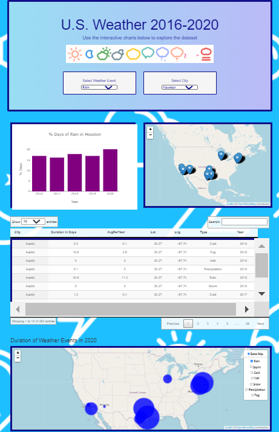

#### US Weather Events (2016 - 2020)

#### Project 3 – Group 4
**August 16, 2021**

**Project Summary/Objective:**

- **The team’s primary objective is to create an interactive dashboard page with visualizations identifying significant weather events/trends in the most populated US cities.** 
- **Project requirements: Postgres SQL, Pandas data queries, Java Script, HTML, Python Flask powered API, Leaflet, Plotly and JS DataTable Library (not covered in class)**

